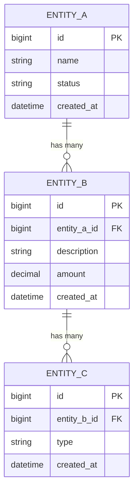

# Database Design Document

**Domain / System:** [Name]
**Document ID:** DDD-[IDENTIFIER]-[VERSION]
**Status:** `Draft` | `In Review` | `Approved` | `Superseded`
**Version:** 1.0.0
**Database Engine:** [MySQL 8.x / PostgreSQL 16 / SQLite / etc.]
**Date:** YYYY-MM-DD
**Author(s):** [Name, Role]
**Reviewers:** [Name, Role]

---

## 1. Overview

### 1.1 Purpose

[2-3 sentences: what domain does this schema model, what system does it support, and what are the primary data integrity requirements?]

### 1.2 Design Decisions Summary

| Decision | Choice | Rationale |
| :--- | :--- | :--- |
| Normalization level | 3NF | [Reason] |
| Primary key strategy | `BIGINT UNSIGNED AUTO_INCREMENT` / `UUID` | [Reason] |
| Soft delete strategy | `deleted_at DATETIME NULL` / Hard delete | [Reason] |
| Timestamp precision | `DATETIME(6)` (microseconds) | High-precision audit trails |
| Money / financial amounts | `DECIMAL(19,4)` | Exact decimal arithmetic; never FLOAT |
| Character set | `utf8mb4` | Full Unicode including emoji |
| Collation | `utf8mb4_unicode_ci` | Case-insensitive, accent-sensitive comparison |

---

## 2. Entity-Relationship Diagram



### Relationship Summary

| Relationship | Type | Enforced By | Cascade Behavior |
| :--- | :--- | :--- | :--- |
| Entity A → Entity B | One-to-Many | FK constraint | `ON DELETE RESTRICT` |
| Entity B → Entity C | One-to-Many | FK constraint | `ON DELETE CASCADE` |

---

## 3. Table Definitions

> Full DDL for each table. Each table must have: primary key, all foreign keys, NOT NULL constraints, appropriate data types, and all required indexes.

### 3.1 `[table_name]`

**Purpose:** [What this table stores. One sentence.]

```sql
CREATE TABLE [table_name] (
  -- Primary Key
  id                  BIGINT UNSIGNED     NOT NULL AUTO_INCREMENT,

  -- Foreign Keys
  [parent_id]         BIGINT UNSIGNED     NOT NULL
    COMMENT 'FK -> [parent_table].id',

  -- Core Columns
  [column_name]       VARCHAR(255)        NOT NULL
    COMMENT '[Plain English description of what this column stores]',

  [amount_column]     DECIMAL(19, 4)      NOT NULL DEFAULT '0.0000'
    COMMENT 'Financial amount. Always use DECIMAL for money, never FLOAT.',

  [status_column]     ENUM(
                        'active',
                        'suspended',
                        'cancelled'
                      )                   NOT NULL DEFAULT 'active'
    COMMENT 'Lifecycle status of this record.',

  [nullable_column]   TEXT                    NULL DEFAULT NULL
    COMMENT '[What this is. NULL means: not yet provided.]',

  [flag_column]       TINYINT(1)          NOT NULL DEFAULT 0
    COMMENT '1 = [True state]; 0 = [False state].',

  -- Timestamps
  created_at          DATETIME(6)         NOT NULL DEFAULT CURRENT_TIMESTAMP(6)
    COMMENT 'Record creation time. UTC. Microsecond precision.',
  updated_at          DATETIME(6)         NOT NULL DEFAULT CURRENT_TIMESTAMP(6)
                                                   ON UPDATE CURRENT_TIMESTAMP(6)
    COMMENT 'Last modification time. UTC.',
  deleted_at          DATETIME(6)             NULL DEFAULT NULL
    COMMENT 'Soft delete timestamp. NULL = active record.',

  -- Constraints
  PRIMARY KEY (id),
  CONSTRAINT fk_[table]_[parent]
    FOREIGN KEY ([parent_id]) REFERENCES [parent_table] (id)
    ON DELETE RESTRICT
    ON UPDATE CASCADE,

  -- Indexes
  INDEX idx_[parent_id]     ([parent_id]),
  INDEX idx_[status]        ([status_column]),
  INDEX idx_[created_at]    ([created_at]),
  -- Composite index for common query pattern: WHERE status = ? AND created_at > ?
  INDEX idx_[status_date]   ([status_column], [created_at])

) ENGINE=InnoDB
  DEFAULT CHARSET=utf8mb4
  COLLATE=utf8mb4_unicode_ci
  COMMENT='[Table purpose. Used by: [system/feature].';
```

---

### 3.2 `[next_table_name]`

**Purpose:** [What this table stores.]

```sql
CREATE TABLE [next_table_name] (
  id            BIGINT UNSIGNED NOT NULL AUTO_INCREMENT,
  -- [Columns]
  created_at    DATETIME(6) NOT NULL DEFAULT CURRENT_TIMESTAMP(6),

  PRIMARY KEY (id)
  -- [Indexes]
) ENGINE=InnoDB DEFAULT CHARSET=utf8mb4 COLLATE=utf8mb4_unicode_ci
  COMMENT='[Purpose]';
```

---

## 4. Data Dictionary

> Plain-language description of every non-obvious column. Reviewers and future engineers should not need to guess what a column means.

### `[table_name]`

| Column | Type | Nullable | Default | Description |
| :--- | :--- | :--- | :--- | :--- |
| `id` | `BIGINT UNSIGNED` | No | auto | Auto-incrementing primary key |
| `[parent_id]` | `BIGINT UNSIGNED` | No | - | References `[parent_table].id`. The [entity] that owns this record. |
| `[status]` | `ENUM` | No | `active` | Lifecycle status. `active`: can transact. `suspended`: blocked by admin. `cancelled`: permanently closed. |
| `[amount]` | `DECIMAL(19,4)` | No | `0.0000` | The [what] amount in the record's currency. Always stored as decimal; 4 decimal places for currency systems that require sub-cent precision. |
| `[flag]` | `TINYINT(1)` | No | `0` | `1` if [condition is true]. `0` otherwise. Checked before [specific operation]. |
| `deleted_at` | `DATETIME(6)` | Yes | `NULL` | Soft delete marker. `NULL` means the record is active. Set to the deletion timestamp when logically deleted. Hard deletion is reserved for GDPR erasure requests. |

---

## 5. Indexing Strategy

### 5.1 Hot Query Patterns

> Identify the queries that run most frequently or are most performance-critical. Verify each has an appropriate index.

| Query Pattern | Columns Used | Index | Notes |
| :--- | :--- | :--- | :--- |
| `WHERE [parent_id] = ? ORDER BY created_at DESC` | `[parent_id]`, `created_at` | `idx_[parent_id]` + `idx_[created_at]` | May benefit from composite index |
| `WHERE [status] = ? AND [parent_id] = ?` | `[status]`, `[parent_id]` | `idx_[status_parent]` composite | High selectivity on `[parent_id]` first |
| `WHERE [column] = ? AND deleted_at IS NULL` | `[column]`, `deleted_at` | Partial index or composite | Exclude soft-deleted in all queries |

### 5.2 Index Review Checklist

- [ ] Every FK column has an index
- [ ] Every column used in WHERE on hot queries is indexed
- [ ] Composite indexes are ordered by selectivity (most selective first)
- [ ] No full-table scans on tables expected to grow > 10K rows
- [ ] No redundant indexes (covered by existing composite indexes)

---

## 6. Normalization Decisions

> Document any intentional denormalization and why.

| Table | Denormalization Applied | Justification |
| :--- | :--- | :--- |
| `[table_name]` | `[column]` is a cached aggregate from `[source_table]` | [Performance reason - e.g., computing this at query time requires a JOIN across 3 tables and adds 50ms to every page load] |
| `[table_name]` | `[column]` duplicates data from `[parent_table]` | [Audit requirement - must preserve value at time of record creation, even if parent changes] |

---

## 7. Constraints and Data Integrity

### 7.1 Referential Integrity

| Relationship | Behavior on Parent Delete | Behavior on Parent Update |
| :--- | :--- | :--- |
| `[child_table].[parent_id]` → `[parent_table].id` | `RESTRICT` (block deletion if children exist) | `CASCADE` |
| `[child_table].[fk]` → `[parent_table].id` | `CASCADE` (delete children with parent) | `CASCADE` |
| `[child_table].[fk]` → `[parent_table].id` | `SET NULL` (orphan is allowed) | `CASCADE` |

### 7.2 Application-Level Rules

The following rules are enforced at the application layer (not DB constraints), documented here for completeness:

- [Rule 1 - e.g., `amount` must be > 0 for payment records (validated in PaymentService before INSERT)]
- [Rule 2 - e.g., A merchant may have at most 100 active payment links (enforced in PaymentLinkService)]

---

## 8. Sensitive Data Classification

| Table | Column | Classification | Storage Method | Retention |
| :--- | :--- | :--- | :--- | :--- |
| `[table]` | `[column]` | `Restricted` | AES-256 encrypted | [Policy] |
| `[table]` | `[column]` | `Confidential` | Hashed (bcrypt / SHA-256) | Indefinite |
| `[table]` | `[column]` | `Confidential` | Plaintext (access-controlled) | [Policy] |

---

## 9. Migration Plan

### 9.1 Migration Files

| Migration File | Type | Description | Reversible? |
| :--- | :--- | :--- | :--- |
| `YYYYMMDD_HHMMSS_create_[table].sql` | `CREATE TABLE` | Initial schema creation | Yes - `DROP TABLE IF EXISTS` |
| `YYYYMMDD_HHMMSS_add_[column]_to_[table].sql` | `ALTER TABLE ADD` | Adding new column | Yes - `ALTER TABLE DROP COLUMN` |
| `YYYYMMDD_HHMMSS_create_idx_[name].sql` | `CREATE INDEX` | Adding index | Yes - `DROP INDEX` |

### 9.2 Migration Risks

| Risk | Affected Table | Row Count Estimate | Mitigation |
| :--- | :--- | :--- | :--- |
| Lock contention on `ALTER TABLE` | `[table]` | [N million rows] | Run during low-traffic window; use `pt-online-schema-change` or `gh-ost` |
| Data type change on existing column | `[table].[column]` | [N rows] | Test conversion on staging copy first; verify no truncation |

### 9.3 Rollback

```sql
-- Rollback script for this migration
-- Run in reverse order of the migration

DROP INDEX IF EXISTS idx_[name] ON [table];
ALTER TABLE [table] DROP COLUMN IF EXISTS [column];
DROP TABLE IF EXISTS [new_table];
```

---

## 10. Open Questions

| ID | Question | Impact | Owner | By |
| :--- | :--- | :--- | :--- | :--- |
| OQ-001 | [Schema question] | [Impact if wrong] | [Name] | YYYY-MM-DD |
