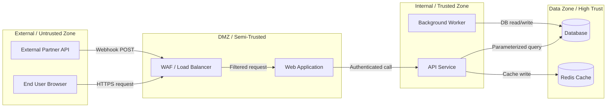

# Security Threat Model

**System / Feature:** [Name]
**Document ID:** STM-[IDENTIFIER]-[VERSION]
**Status:** `Draft` | `In Review` | `Accepted` | `Outdated`
**Version:** 1.0.0
**Date:** YYYY-MM-DD
**Author(s):** [Name, Role]
**Reviewers:** [Name, Role - Security], [Name, Role - Engineering Lead]

---

## 1. Scope and Assumptions

### 1.1 In Scope

- [Component / subsystem / integration being modeled]
- [Data flows being analyzed]
- [Specific threat actors being considered]

### 1.2 Out of Scope

- [Components explicitly excluded - e.g., "Physical security of the data center is out of scope"]
- [Threats not modeled - e.g., "Nation-state APT attacks are out of scope for this review"]

### 1.3 Assumptions

> 🔶 These assumptions limit the model. If they are wrong, the threat model must be revised.

| Assumption | Risk if Wrong |
| :--- | :--- |
| [e.g., Infrastructure is managed by a trusted cloud provider with SOC 2 Type II certification] | [If wrong: infrastructure threats must be added to scope] |
| [e.g., All engineers with production access are trusted insiders] | [If wrong: insider threat analysis is required] |

---

## 2. System Overview

### 2.1 Description

[Brief description of the system or feature being modeled. What does it do? Who uses it? What data does it handle?]

### 2.2 Data Flow Diagram (DFD)

> Mark trust boundaries with dashed lines. Every time data crosses a boundary, it is a potential attack vector.

### 2.3 Trust Zones

| Zone | Trust Level | Components | What Crosses This Boundary |
| :--- | :--- | :--- | :--- |
| External | None | User browser, partner systems | All user input, incoming webhooks |
| DMZ | Low | WAF, load balancer, web server | Validated HTTP requests |
| Internal | Medium | API, workers, services | Authenticated, sanitized data |
| Data | High | Database, cache, queue | Parameterized queries, structured data |

### 2.4 Assets Being Protected

| Asset | Classification | Value | Location |
| :--- | :--- | :--- | :--- |
| [e.g., User credentials] | `Restricted` | `Critical` | Database |
| [e.g., API secrets / keys] | `Restricted` | `Critical` | Config / Key store |
| [e.g., Payment transaction data] | `Confidential` | `High` | Database |
| [e.g., User PII] | `Confidential` | `High` | Database |
| [e.g., Session tokens] | `Confidential` | `High` | Redis |
| [e.g., Audit logs] | `Internal` | `Medium` | Log storage |

---

## 3. STRIDE Threat Analysis

> For each component and data flow, enumerate threats in each STRIDE category.

---

### 3.1 Spoofing Threats

| ID | Component / Flow | Threat Description | Attack Scenario | Probability | Impact | Risk | Mitigation | Residual Risk |
| :--- | :--- | :--- | :--- | :--- | :--- | :--- | :--- | :--- |
| S-001 | Login endpoint | Credential stuffing - attacker uses leaked credentials from other breaches to log in | Automated tool submits millions of username/password pairs | High | Critical | **Critical** | Rate limit login: 5 attempts/IP/10 minutes; CAPTCHA after 3 failures; breached password check (HaveIBeenPwned API) | Low |
| S-002 | API authentication | Token replay - attacker captures a valid JWT and uses it after expiry | Man-in-the-middle on a non-TLS connection; stolen from local storage | Low | High | **Medium** | Short token expiry (15 min); TLS enforced everywhere; tokens stored in httpOnly cookies, not localStorage | Low |
| S-003 | Webhook receiver | Spoofed webhook - attacker sends a forged webhook pretending to be the payment gateway | Direct HTTP POST to webhook endpoint with fabricated payload | High | High | **Critical** | HMAC-SHA256 signature verification on every incoming webhook; reject if signature invalid or timestamp > 5 minutes old | Low |
| S-004 | [Next component] | [Threat] | [Scenario] | | | | [Mitigation] | |

---

### 3.2 Tampering Threats

| ID | Component / Flow | Threat Description | Attack Scenario | Probability | Impact | Risk | Mitigation | Residual Risk |
| :--- | :--- | :--- | :--- | :--- | :--- | :--- | :--- | :--- |
| T-001 | Database writes | SQL injection - attacker injects SQL through user-controlled input | Malicious input in payment amount, merchant name, or search field | Medium | Critical | **Critical** | Parameterized PDO queries enforced at repository layer; no string interpolation in any SQL; PHPStan analysis enforces this | Low |
| T-002 | Data in transit | MITM - attacker intercepts and modifies data between client and server | Network interception on public Wi-Fi | Low | High | **High** | TLS 1.2+ enforced; HSTS header (`max-age=31536000; includeSubDomains; preload`); no HTTP fallback | Low |
| T-003 | File uploads | Malicious file upload - attacker uploads PHP/executable disguised as image | Upload `shell.php.jpg` to avatar upload endpoint | Medium | Critical | **Critical** | Validate MIME type by content (not extension); store uploads outside webroot; serve via controller, never directly | Low |
| T-004 | [Next component] | [Threat] | [Scenario] | | | | [Mitigation] | |

---

### 3.3 Repudiation Threats

| ID | Component / Flow | Threat Description | Attack Scenario | Probability | Impact | Risk | Mitigation | Residual Risk |
| :--- | :--- | :--- | :--- | :--- | :--- | :--- | :--- | :--- |
| R-001 | Financial transactions | Disputed transaction - user/merchant denies initiating a payment or refund | Merchant claims they did not create a refund that was processed | Medium | High | **High** | Immutable audit log (`op_audit_log`) records all write operations with: actor ID, actor IP, action, before/after state, timestamp | Low |
| R-002 | Admin actions | Privilege abuse - admin denies deleting a user account | Admin deletes account and denies it | Low | Medium | **Medium** | All admin actions logged with actor identity; logs are append-only and stored in tamper-evident storage | Low |
| R-003 | [Next component] | [Threat] | [Scenario] | | | | [Mitigation] | |

---

### 3.4 Information Disclosure Threats

| ID | Component / Flow | Threat Description | Attack Scenario | Probability | Impact | Risk | Mitigation | Residual Risk |
| :--- | :--- | :--- | :--- | :--- | :--- | :--- | :--- | :--- |
| I-001 | Error responses | Stack trace / path disclosure - server returns internal error details to client | Unhandled exception reveals file paths, database schema, or library versions | High | Medium | **High** | Custom error handler for all exceptions; generic error message to client (`internal_error`); full detail only in server-side logs | Low |
| I-002 | API responses | IDOR - attacker accesses another user's data by manipulating resource IDs | `GET /v1/merchants/999/transactions` with a token for merchant 1 | Medium | High | **Critical** | Tenant scope enforced at repository layer; every query includes `merchant_id = ?` from auth context; ID enumeration prevented by using ULIDs/UUIDs | Low |
| I-003 | Logs | PII / secret in logs - sensitive data inadvertently logged | Password, card number, or API key appears in application log | Medium | High | **High** | Log sanitizer middleware strips known sensitive fields before writing; code review checklist includes log review | Medium |
| I-004 | [Next component] | [Threat] | [Scenario] | | | | [Mitigation] | |

---

### 3.5 Denial of Service Threats

| ID | Component / Flow | Threat Description | Attack Scenario | Probability | Impact | Risk | Mitigation | Residual Risk |
| :--- | :--- | :--- | :--- | :--- | :--- | :--- | :--- | :--- |
| D-001 | API endpoints | Application-layer DoS - attacker floods API with expensive requests | Repeated `POST /payments` with large payloads or computation-heavy operations | Medium | High | **High** | Rate limiting per IP + per token; request body size limit (1MB default, 10MB for file uploads); queue expensive operations async | Medium |
| D-002 | Database | Slow query DoS - malicious or crafted query exhausts DB connections | Query with large `IN` clause or missing index causes full table scan | Low | Critical | **High** | Query timeout enforced (5 seconds); paginated queries only; slow query log monitored; indexed columns validated | Low |
| D-003 | [Next component] | [Threat] | [Scenario] | | | | [Mitigation] | |

---

### 3.6 Elevation of Privilege Threats

| ID | Component / Flow | Threat Description | Attack Scenario | Probability | Impact | Risk | Mitigation | Residual Risk |
| :--- | :--- | :--- | :--- | :--- | :--- | :--- | :--- | :--- |
| E-001 | RBAC bypass | Permission bypass - authenticated user accesses action beyond their role | Staff member calls an admin-only API endpoint by discovering the URL | Medium | High | **High** | Permission check enforced in middleware for every route; route-to-permission mapping is explicit and auditable | Low |
| E-002 | Mass assignment | Over-posting - attacker sends extra fields (e.g., `is_admin: true`) in a POST body | POST to profile update endpoint with `"role": "admin"` in body | Medium | Critical | **Critical** | Allowlist input via validated DTO/schema; never bind raw request body directly to model | Low |
| E-003 | Path traversal | Directory traversal - attacker accesses files outside webroot | `../../../etc/passwd` in a file path parameter | Low | Critical | **High** | Validate all file paths; use `realpath()` and confirm path is within allowed directory; no user input in file paths | Low |
| E-004 | [Next component] | [Threat] | [Scenario] | | | | [Mitigation] | |

---

## 4. Risk Register (Prioritized)

| Threat ID | Description | Risk Level | Owner | Mitigation Status | Target Date |
| :--- | :--- | :--- | :--- | :--- | :--- |
| S-001 | Credential stuffing on login | Critical | [Name] | `Implemented` / `In Progress` / `Planned` / `Accepted` | YYYY-MM-DD |
| S-003 | Spoofed webhook | Critical | [Name] | `Implemented` | - |
| T-001 | SQL injection | Critical | [Name] | `Implemented` | - |
| T-003 | Malicious file upload | Critical | [Name] | `In Progress` | YYYY-MM-DD |
| I-002 | IDOR on resources | Critical | [Name] | `Implemented` | - |
| E-002 | Mass assignment | Critical | [Name] | `Implemented` | - |
| [Lower risk items...] | | High / Medium / Low | | | |

---

## 5. Security Controls Verified

> Checklist of security controls that MUST be verified before this feature ships.

- [ ] Rate limiting applied to all authentication endpoints
- [ ] Rate limiting applied to all sensitive write operations
- [ ] All inputs validated and sanitized at the system boundary
- [ ] No sensitive data in logs or error responses
- [ ] All new API endpoints require authentication
- [ ] IDOR protections in place (tenant scope at repository layer)
- [ ] HMAC verification on all inbound webhooks
- [ ] File uploads stored outside webroot and served via controller
- [ ] No user-controlled data in SQL queries (parameterized queries only)
- [ ] TLS enforced; no HTTP fallback
- [ ] HSTS header configured
- [ ] Audit log entries created for all state-changing operations
- [ ] OWASP ZAP or equivalent scan run on new endpoints

---

## 6. Recommended Security Testing

| Test | Method | When | Owner |
| :--- | :--- | :--- | :--- |
| Authentication bypass | Manual pen-test of login + session flows | Before release | Security / QA |
| IDOR testing | Automated + manual cross-account access tests | Before release | Security |
| Input fuzzing | OWASP ZAP active scan on all new endpoints | Before release | QA |
| Dependency audit | `composer audit` / `npm audit` | On every build | CI/CD |
| Secret scanning | `git-secrets` / GitHub secret scanning | On every commit | CI/CD |
| Annual pen-test | Full external penetration test | Annually | External firm |
