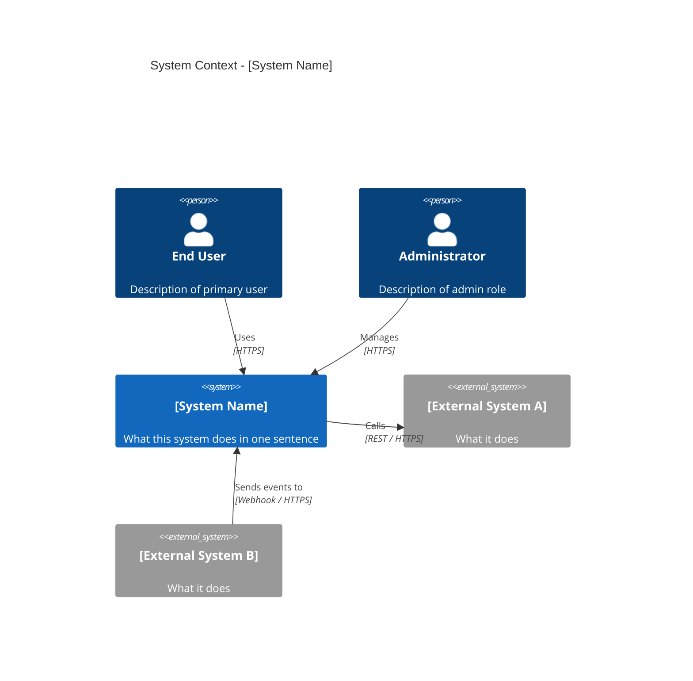
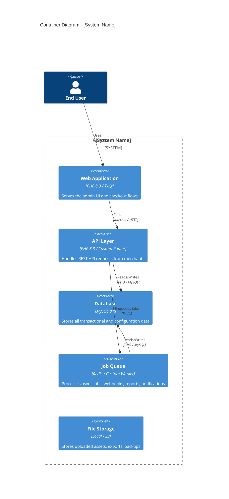
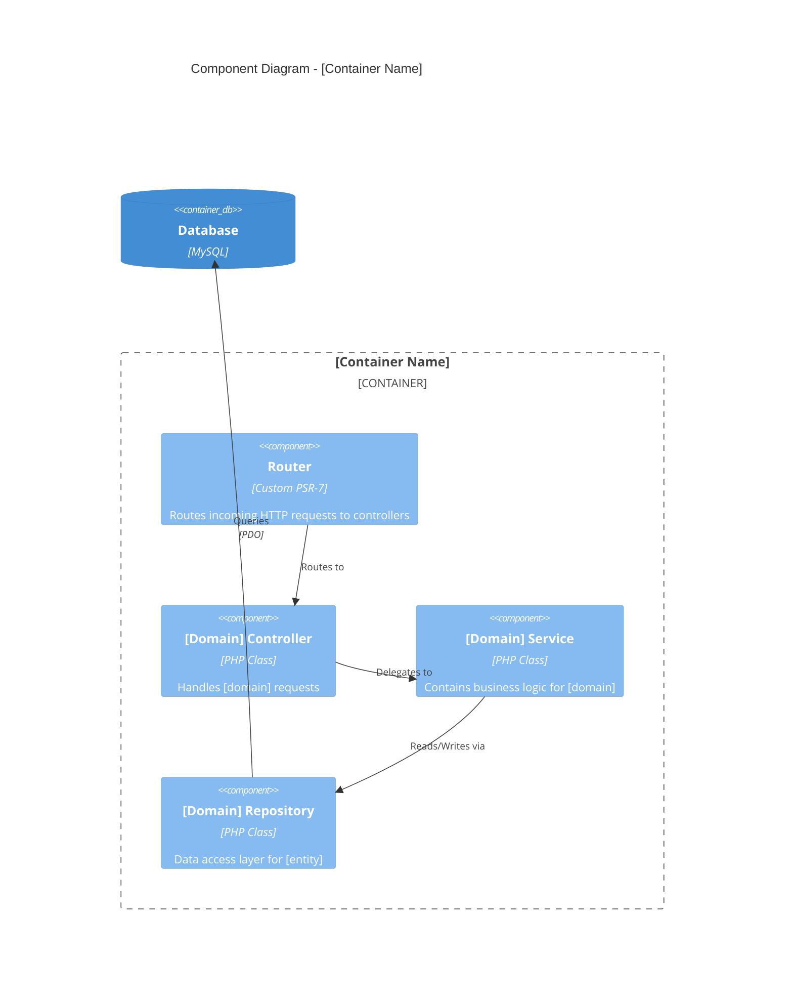
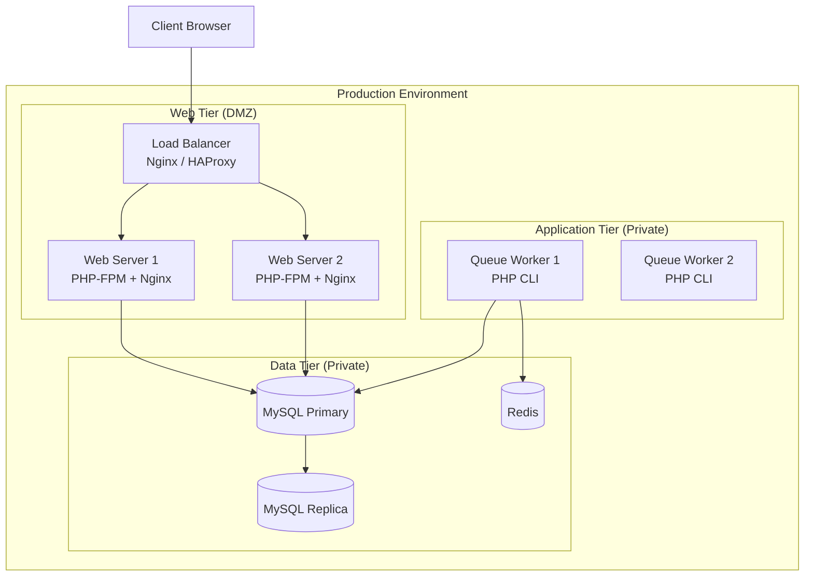
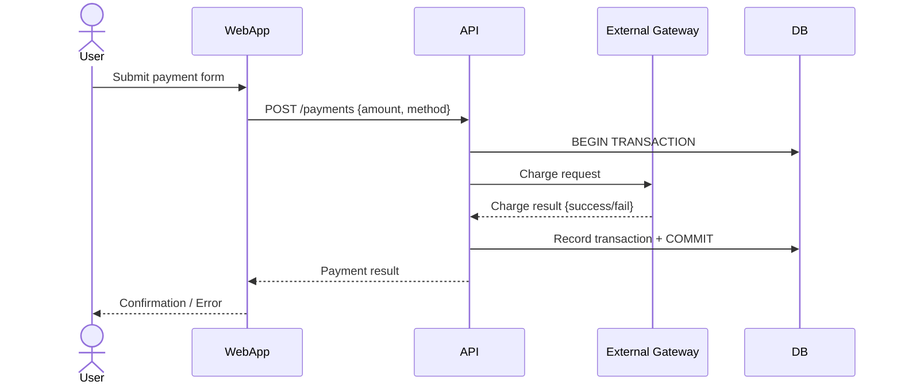
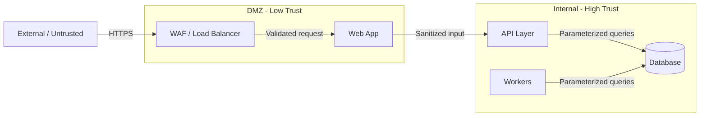

# System Architecture Document

**System:** [System Name]
**Document ID:** SAD-[SYSTEM]-[VERSION]
**Status:** `Draft` | `In Review` | `Approved` | `Superseded`
**Version:** 1.0.0
**Date:** YYYY-MM-DD
**Author(s):** [Name, Role]
**Reviewers:** [Name, Role] | [Name, Role]

---

## 1. Executive Summary

> 2-3 paragraphs. Describe the system's purpose, its architectural style (monolith, microservices, event-driven, layered, etc.), the key drivers that shaped the architecture (NFRs, constraints, team structure), and the most important architectural decisions made.

---

## 2. Architecture Principles

> The guiding principles that govern all architectural decisions in this system. These act as tie-breakers when trade-offs arise.

| Principle | Rationale | Implication |
| :--- | :--- | :--- |
| [e.g., Simplicity over sophistication] | [Reason] | [What this means in practice] |
| [e.g., Explicit over implicit] | [Reason] | [What this means in practice] |
| [e.g., Data integrity over performance] | [Reason] | [What this means in practice] |

---

## 3. System Context (C4 Level 1)

> Who uses the system and what external systems does it depend on or serve? Intended for all stakeholders, including non-technical.

### External System Dependencies

| External System | Direction | Protocol | Purpose | SLA Dependency |
| :--- | :--- | :--- | :--- | :--- |
| [System A] | Outbound | REST/HTTPS | [Why we call it] | Yes / No |
| [System B] | Inbound | Webhook | [Why it calls us] | No |

---

## 4. Container Architecture (C4 Level 2)

> The major deployable/executable units. Each container has its own process space, deployment lifecycle, and technology.

### Container Inventory

| Container | Technology | Responsibility | Scalability Strategy |
| :--- | :--- | :--- | :--- |
| [Web App] | [PHP 8.3 / Twig] | [Description] | [Horizontal / Vertical] |
| [API] | [PHP 8.3] | [Description] | [Horizontal] |
| [Database] | [MySQL 8.x] | [Description] | [Read replicas / Sharding] |
| [Queue] | [Redis] | [Description] | [Horizontal workers] |

---

## 5. Component Architecture (C4 Level 3)

> Internal structure of the most critical containers. Not required for every container - focus on the most complex ones.

### 5.1 [Container Name] - Internal Components

---

## 6. Deployment View

> Where do the containers run? What is the network topology? What cloud regions or data centers are involved?

### Infrastructure Inventory

| Component | Type | Specs | Count | Region | Managed By |
| :--- | :--- | :--- | :--- | :--- | :--- |
| Web Server | VPS / Container | [CPU/RAM] | [N] | [Region] | [Team] |
| Database Primary | VPS / RDS | [CPU/RAM/Storage] | 1 | [Region] | [Team] |

---

## 7. Process View - Key Flows

> How does the system behave at runtime for its most critical use cases?

### 7.1 [Critical Flow Name - e.g., Payment Processing]

### 7.2 [Next Critical Flow]

[Follow same structure]

---

## 8. Integration Map

> Every integration point the system has with external systems.

| Integration | Direction | Protocol | Auth | Data Format | Error Handling | SLA |
| :--- | :--- | :--- | :--- | :--- | :--- | :--- |
| [External System A] | Outbound | REST/HTTPS | API Key | JSON | Retry x3, exponential backoff | 99.9% |
| [External System B] | Inbound | Webhook | HMAC-SHA256 | JSON | Return 200 immediately, process async | N/A |

---

## 9. Data Flow and Trust Boundaries

> Where does data enter the system, how does it move between containers, and where are the trust boundaries?

### Sensitive Data Classification

| Data Category | Classification | Storage | Transmission | Retention |
| :--- | :--- | :--- | :--- | :--- |
| Payment card data | `Restricted` | Tokenized / Not stored | TLS 1.2+ | Never raw |
| User PII | `Confidential` | Encrypted at rest | TLS 1.2+ | Per GDPR policy |
| Session tokens | `Confidential` | Server-side (Redis) | HTTPS only | Session lifetime |
| API keys | `Confidential` | Hashed (SHA-256) | HTTPS only | Indefinite |

---

## 10. Quality Attribute Requirements

> The architectural decisions here are driven by specific measurable NFRs.

| Quality Attribute | Target | Architectural Decision | ADR Reference |
| :--- | :--- | :--- | :--- |
| Availability | 99.9% uptime | Multi-instance deployment behind load balancer | ADR-003 |
| Performance | p99 < 200ms API response | MySQL connection pooling + Redis caching | ADR-005 |
| Security | Zero SQL injection risk | Parameterized PDO queries enforced at repo layer | ADR-002 |
| Scalability | 10x traffic handled without code change | Stateless web tier; horizontal scaling | ADR-004 |
| Maintainability | New developer productive in < 1 week | PSR-4 autoloading, clear layer separation | ADR-001 |

---

## 11. Architecture Decision Record Log

> Summary of all significant architectural decisions. Each ADR is an immutable record. Use `adr-template.md` for the full detail.

| ADR ID | Title | Status | Date | Summary |
| :--- | :--- | :--- | :--- | :--- |
| ADR-001 | [Decision title] | `Accepted` | YYYY-MM-DD | [One-sentence summary of the decision] |
| ADR-002 | [Decision title] | `Accepted` | YYYY-MM-DD | [One-sentence summary] |
| ADR-003 | [Decision title] | `Superseded by ADR-007` | YYYY-MM-DD | [One-sentence summary] |

---

## 12. Known Technical Debt

> Architectural compromises made deliberately. Documenting these prevents them from becoming invisible and permanent.

| Item | Description | Why Accepted | Remediation Path | Priority |
| :--- | :--- | :--- | :--- | :--- |
| [Debt item] | [Technical detail] | [Constraint that forced the compromise] | [How to fix eventually] | `High` / `Medium` / `Low` |

---

## 13. Glossary

| Term | Definition |
| :--- | :--- |
| [Domain / Technical term] | [Plain-language definition] |
